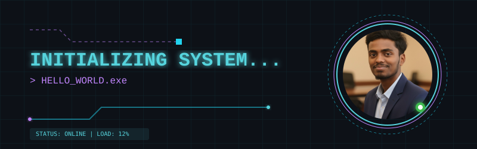

### SYSTEM STATUS: [ONLINE] // ACCESS GRANTED

## ⚡ CORE DIRECTIVES & LOADOUT

  
  
  
  
  
  

## 🚀 FEATURED NEURAL ARCHITECTURES

> [!IMPORTANT]
> **[AI-Driven Depression Prediction](https://github.com/vasu6369/Mental-Health-Prediction)**
> An end-to-end ML pipeline with a Flask API that predicts mental health states from text using TF-IDF and SVM, achieving 82% classification accuracy in real-time.
> `Python` | `Flask` | `Scikit-learn` | `SVM`

> [!TIP]
> **[Food Delivery Platform](https://github.com/vasu6369/Food-delivery-app-MERN)**
> A full-stack food ordering platform featuring dynamic menu rendering, a persistent cart, and secure JWT authentication.
> `MERN Stack` | `Spring Boot` | `React.js`

> [!NOTE]
> **[Agentic AI System for Crop Nutrient Diagnosis](https://github.com/vasu6369)**
> A full-stack xAI system using an LLM and CNN to diagnose crop nutrient deficiencies, integrating a multi-step RAG pipeline for treatment recommendations.
> `Python` | `React.js` | `FastAPI` | `LLM` | `CNN`

## 📊 SYSTEM ANALYTICS & TELEMETRY

### ACTIVITY OVERRIDE

### CONTRIBUTION MATRIX

### DIAGNOSTICS & PROTOCOLS
<table border="0" align="center" style="border: none;">
  <tr>
    <td align="center" style="border: none;">
      
    </td>
    <td align="center" style="border: none;">
      
    </td>
  </tr>
</table>

### STREAK INTEGRITY

## 📡 RECENT TRANSMISSIONS

<!--START_SECTION:activity-->
1. 🎉 Merged PR [#1](https://github.com/vasu6369/vasu6369/pull/1) in [vasu6369/vasu6369](https://github.com/vasu6369/vasu6369)
2. 💪 Opened PR [#1](https://github.com/vasu6369/vasu6369/pull/1) in [vasu6369/vasu6369](https://github.com/vasu6369/vasu6369)
<!--END_SECTION:activity-->

<!--START_SECTION:content-->
<!--END_SECTION:content-->

